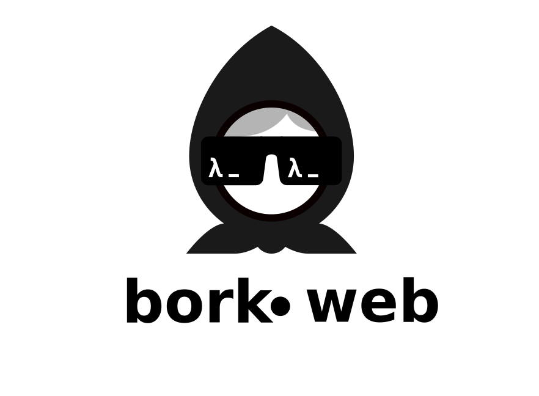

[](https://github.com/m3tti/borkweb)

[](https://clojurians.slack.com/app_redirect?channel=borkweb)
[](http://clojurians.net)

# Borkweb: A Simpler Approach to modern Web Development
Borkweb is an effort to create a full-stack Clojure framework that is simple, minimal and traditional. I believe that the complexity and overhead of modern web development frameworks have made it difficult for developers to focus on building great applications. Our goal is to provide a tool that allows developers to work efficiently and effectively, without getting bogged down in unnecessary configurations and integrations.

## Why Borkweb?
I didn't create Borkweb as a proof-of-concept or a side project. I created it because I needed it. I was building real applications and was frustrated with the complexity and overhead of existing frameworks. I wanted a tool that would allow me to focus on building great applications, without getting bogged down in unnecessary configurations and integrations. Borkweb is the result of my efforts, and I've been using it in production for my own applications.

## Core Values
* **Simple**: Borkweb is designed to be easy to use and understand, with a minimal learning curve.
* **Minimal**: I believe that less is more. Borkweb has a small footprint and doesn't require a multitude of dependencies.
* **Traditional**: I'm not trying to reinvent the wheel. Borkweb builds on established principles and best practices.
* **Flexible**: Borkweb is designed to be adaptable to the needs of the developer. We avoid tying it too closely to conventions, allowing you to bend it to your will and use it as a starting point for your projects, rather than a rigid framework that restricts your creativity.

## Full-Stack Clojure
Borkweb is a full-stack framework that uses Clojure on all ends. This means you can write your frontend code in ClojureScript using Squint, your CSS in Gaka, and your backend code in Babashka. Everything backed by a traditional SQL database.

## No Overhead
One of the key benefits of Borkweb is that it requires minimal overhead. You don't need to worry about setting up a complex build pipeline or managing a multitude of dependencies. With Babashka, you can simply write your code and run it. No need for Node.js, no need for a separate frontend build process. Just write, run, and deploy.


## Contributing
Borkweb is an open-source project, and I welcome contributions from anyone who is interested in helping to make it better. If you have an idea for a feature or a bug fix, please open an issue or submit a pull request. 

## Dependencies
- [ruuter](https://github.com/askonomm/ruuter)
- [squint](https://github.com/squint-cljs/squint)
- [babashka-sql-pod](https://github.com/babashka/babashka-sql-pods) <- depending on runtime
- [next.jdbc](https://github.com/seancorfield/next-jdbc) <- depending on runtime
- [http-kit](https://github.com/http-kit/http-kit)
- [cheshire](https://github.com/dakrone/cheshire)
- [ring](https://github.com/ring-clojure/ring)
- [honeysql](https://github.com/seancorfield/honeysql)
- [gaka](https://github.com/cdaddr/gaka)

### Frontend third party
- [preact](preactjs.com)
- [bootstrap.css](https://getbootstrap.com)

## Get started
borkweb only needs babashka to get started. To run the template just do a `bb -m core` and you are good to go. If you want to have the login and register code up and running you should consider to create a database. Borkweb comes with [HSQLDB](https://hsqldb.org/) by default. So there is no need to have a real database at hand. It is recommended for production workloads to use Postgres or other RDBMS systems. The HSQLDB is set to support the Postgres dialect to make it seamless to switch between development and production without the need for a RDBMS system on your dev host.

### Everything starts with a Database
The initialization of the database is currently done with an `initsql.edn` file which you can trigger with `bb -m database.core/initialize-db`.
The database connection parameters are available in `database/core.cljs` just replace as you like.
Currently hsqldb and postgres are used for the database backend but you can basically use any sql database that you like and which is supported by your runtime. If you want to use a diffrent db like datalevin you'll lose the registration and login functionality and have to adjust some stuff.
The `initsql.edn` is basically [honeysql](https://github.com/seancorfield/honeysql). You can lookup all special keywords and such at the [documentation](https://cljdoc.org/d/com.github.seancorfield/honeysql/2.6.1196/doc/readme).

### Routing
Routing can be done in the `routes.clj` file found in the base folder. There are already premade helper functions to generate routes in a compojuresque style.

``` clojure
(route path method (fn [req] body))
(get path (fn [req] body))
(post path (fn [req] body))
(option path (fn [req] body))
(put path (fn [req] body))
(delete path (fn [req] body))
```

### CLJS
borkweb provides already everything you need to get started with cljs no need for any bundler or anything else.
Get to `resources/cljs` drop your cljs code that is squint compliant and you are good to go. borkweb allready includes some examples for preact and preact web components. There are helper functions to compile cljs code in your hiccup templates. You can find them in `view/components.clj`
`cljs-module` to generate js module code and `cljs-resource` to create plain javascript code. there is even `->js` which can be used to trigger squint/cljs code inline.

``` clojure
;; resources/cljs/counter.cljs
(require '["https://esm.sh/preact@10.19.2" :as react])
(require '["https://esm.sh/preact@10.19.2/hooks" :as hooks])

(defn Counter []
  (let [[counter setCounter] (hooks/useState 0)]
    #jsx [:<>
          [:div "Counter " counter]
          [:div {:role "group" :class "btn-group"}
           [:button {:class "btn btn-primary" :onClick #(setCounter (inc counter))} "+"]
           [:button {:class "btn btn-primary" :onClick #(setCounter (dec counter))} "-"]]]))

(defonce el (js/document.getElementById "cljs"))

(react/render #jsx [Counter] el)
```

``` clojure
;; view/some_page.clj
(require '[view.components :as c])

(defn some-page [req]
  [:h1 "My fancy component page"]
  [:div#cljs]
  ;; just use the filename without cljs. the function will search in the resource/cljs folder.
  (c/cljs-module "counter"))
```

## Roadmap
- [x] add simple [pwa](https://web.dev/explore/progressive-web-apps) functinality to make webapps based on borkweb installable
- [x] Add email interface to write and send emails in an easy manner
- [x] Add autocomplete component as webcomponent
- [x] Add hot reload functionality to cljs part of borkweb (long polling? Server side events?)
- [ ] Exchange data with frontend components without an api (inline json?)
- [ ] Add FileUpload Drop Area Component
- [ ] Add base64 upload code which zips data first with [zip.js](https://gildas-lormeau.github.io/zip.js/)
- [ ] Add Html5 Modal window
- [ ] Provide something like a repl for cljs/squint code. Maybe also directly in the browser to trigger functions @borkdude supported the repl option to squint which might be a good idea.
- [ ] Provide a simple production ready docker-compose config with postgress, caddy (as reverse proxy), and the babashka app. Everything easily scaleable through replicas.
- [ ] Support [datalevin](https://github.com/juji-io/datalevin) as second database engine with an easy switch via a setting.
- [ ] make a port to common lisp one day :tada:

## Articles
* [Babashka's First Web Framework](https://github.com/m3tti/m3tti.github.io/blob/master/borkweb-babashkas-first-webframework.md)
* [Building a Blog in Borkweb](https://github.com/m3tti/m3tti.github.io/blob/master/on-building-a-blog-in-borkweb.md)
* [My Journey to Creating Borkweb](https://github.com/m3tti/m3tti.github.io/blob/master/my-journey-to-creating-borkweb.md)
* [Creating Installable Web Apps](https://borkweb.org/blog/2024-10-10-creating-installable-web-apps.md)
