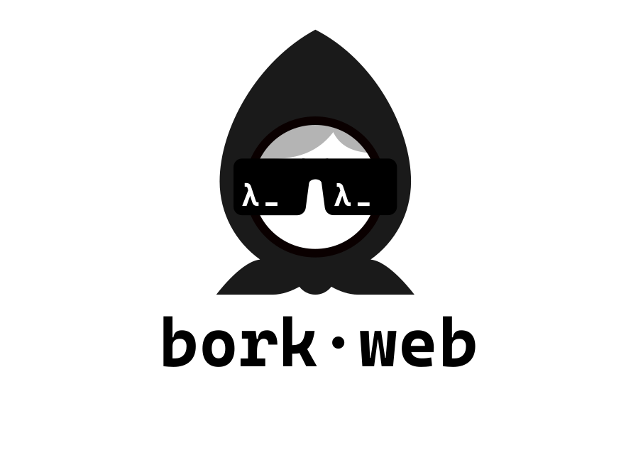

Is a small web template with as little dependencies as possible to get you of the ground fast. It supports a structure for your next web app and integrates a simple user login and register form.

## Dependencies
- [ruuter](https://github.com/askonomm/ruuter)
- [squint](https://github.com/squint-cljs/squint)
- [babashka-sql-pod](https://github.com/babashka/babashka-sql-pods)
- [honeysql](https://github.com/seancorfield/honeysql)
- [gaka](https://github.com/cdaddr/gaka)

